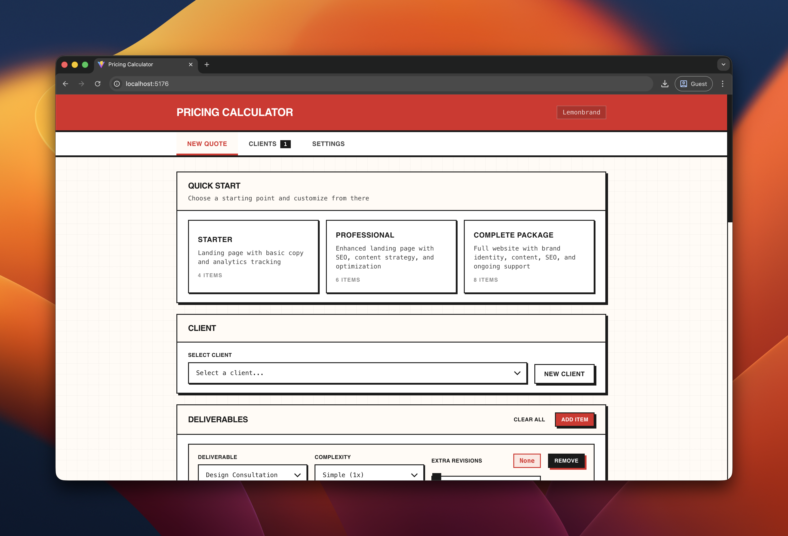

# Pricing Calculator

**Part of the [LemonBrand Build Challenges](https://lemonbrand.io) — tools you build, tools you own.**

A dead-simple pricing calculator for freelancers, consultants, and agencies. No subscriptions. No accounts. Your data stays on your machine.



## The Problem

You're quoting a project. You open a spreadsheet. You forget your rates. You second-guess your complexity multipliers. You spend 30 minutes on something that should take 30 seconds.

This tool fixes that.

## What It Does

- **Quote Builder** — Add deliverables, set complexity, track revisions
- **Client Management** — Save quotes per client, duplicate past work
- **Configurable Pricing** — Your rates, your multipliers, your rules
- **Copy to Clipboard** — Clean text output you can paste anywhere
- **Local Storage** — Everything saves to your browser, nothing leaves your machine

## Quick Start

```bash
# Clone it
git clone https://github.com/lemonbrand/pricing-calc.git
cd pricing-calc

# Install dependencies
npm install

# Run it
npm run dev
```

Open [http://localhost:5173](http://localhost:5173). That's it.

## How It Works

**Three tabs. No complexity.**

### 1. New Quote
Pick a client (or create one), add deliverables, adjust complexity. The total updates as you go.

**Deliverable Types:**
- Landing Page
- Full Website
- Copywriting

**Complexity Tiers:**
- Simple (1x multiplier)
- Medium (1.5x multiplier)
- Complex (2x multiplier)

**Modifiers:**
- Rush fee (adds %)
- Bundle discount (auto-applies with 2+ items)
- Custom discount slider
- Tax toggle

### 2. Clients
View all saved clients and their quote history. Duplicate a past quote to start a new one. Delete what you don't need.

### 3. Settings
Configure everything:
- Business info (shows on copied quotes)
- Base rates per deliverable type
- Complexity multipliers
- Rush fee percentage
- Bundle discount percentage
- Tax rate
- Revisions included

All settings persist in localStorage.

## Project Structure

```
src/
├── components/
│   ├── ui/              # Reusable components (Button, Card, Input, etc.)
│   ├── QuoteBuilder.tsx # Main quote creation interface
│   ├── QuoteItem.tsx    # Individual deliverable row
│   ├── QuoteSummary.tsx # Total calculation + copy/save
│   ├── ClientList.tsx   # Client management
│   └── Settings.tsx     # Configuration panel
├── hooks/
│   ├── useConfig.ts     # Settings state + localStorage
│   └── useQuotes.ts     # Clients/quotes state + localStorage
├── types/
│   └── index.ts         # TypeScript interfaces
├── utils/
│   └── pricing.ts       # All calculation logic
├── App.tsx              # Main app shell + routing
└── index.css            # Tailwind + custom styles
```

## Tech Stack

- **React 19** — UI framework
- **TypeScript** — Type safety
- **Vite** — Build tool
- **Tailwind CSS 4** — Styling
- **localStorage** — Persistence (no backend needed)

## Customization

### Change the deliverable types

Edit `src/types/index.ts`:

```typescript
export type DeliverableType = 'landingPage' | 'fullWebsite' | 'copywriting' | 'yourNewType';

export const DELIVERABLE_LABELS: Record<DeliverableType, string> = {
  landingPage: 'Landing Page',
  fullWebsite: 'Full Website',
  copywriting: 'Copywriting',
  yourNewType: 'Your New Type',
};
```

Then add a base rate in your settings.

### Change the calculation logic

All pricing math lives in `src/utils/pricing.ts`. Modify `calculateItemPrice()` or `calculateTotal()` to change how prices are computed.

### Change the design

The brutal aesthetic uses CSS custom properties defined in `src/index.css`:

```css
--color-brand-red: #DC2626;
--color-cream: #FFFBF5;
--color-ink: #1A1A1A;
--color-ink-light: #404040;
```

Swap these to match your brand.

## Build for Production

```bash
npm run build
```

Output goes to `dist/`. Deploy anywhere that serves static files.

## Why This Exists

This is one of 28 build challenges from [LemonBrand](https://lemonbrand.io). The idea: entrepreneurs and builders shouldn't need to pay monthly subscriptions for simple tools.

Build it once. Own it forever.

## Related Build Challenges

- [**Outbound Engine**](https://github.com/lemonbrand/outbound-engine) — AI-powered podcast guest outreach with anti-AI aesthetic
- **Proposal Generator** — Turn a conversation into a formal proposal
- **Invoice Generator** — Create and track invoices
- **Contract Builder** — Standard agreements with custom terms
- **SOW Generator** — Scope of work documents

See all challenges at [lemonbrand.io](https://lemonbrand.io).

## License

MIT — do whatever you want with it.

---

**Built with [Claude Code](https://claude.ai/code)** as part of a 30-minute build challenge.
